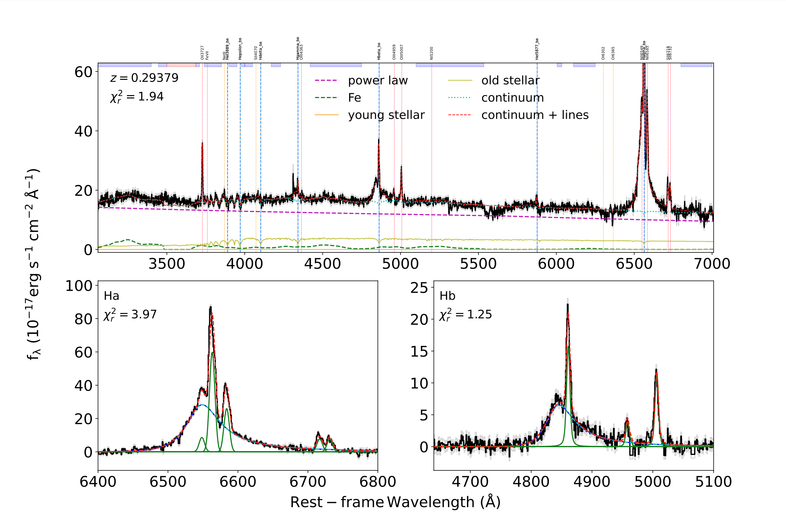
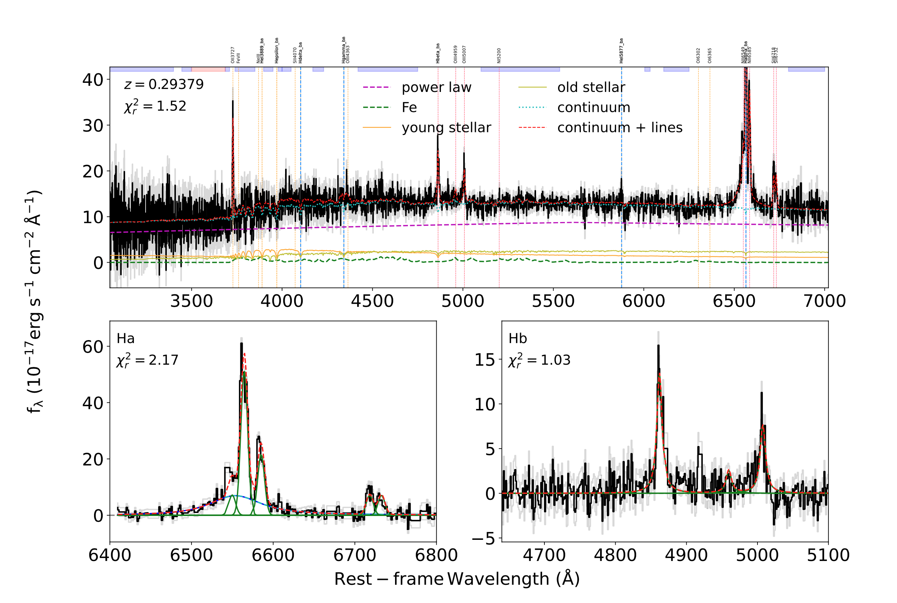
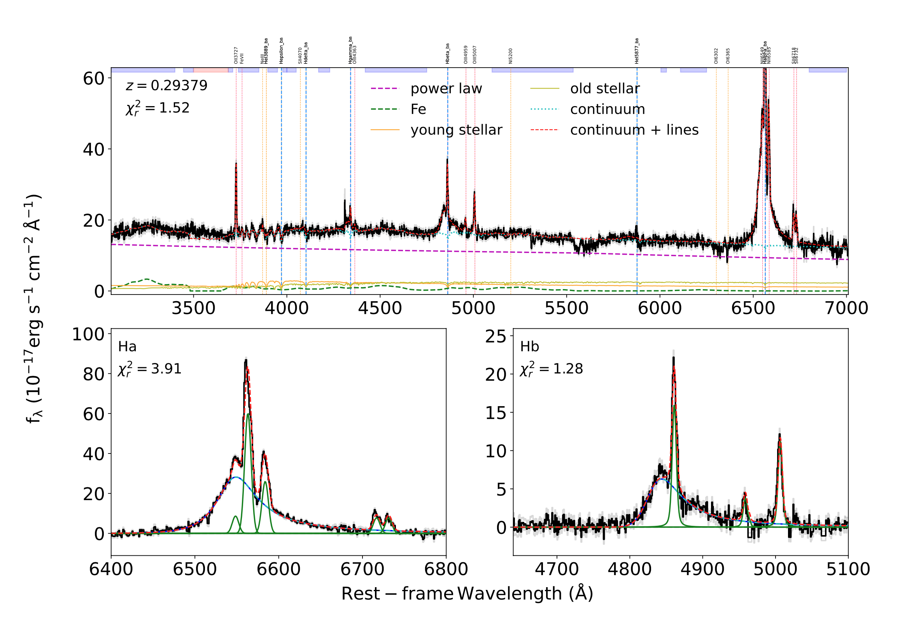

# QGfit


A **Python-based spectral fitting pipeline** for analyzing quasar and galaxy spectra. This pipeline enables the decomposition of spectral components and allows users to fit models to data with customizable parameters.

---

## Features

- Customizable spectral models for quasar and galaxy fitting.
- Simultaneous spectral fitting for multiple (for example, multi-epoch) spectra.
- Supports multi-component decomposition (e.g., AGN/galaxy continuum, emission lines).
- Easy-to-modify parameters to suit various data sources and needs.
- Outputs key metrics, plots, and statistical fits for analysis.

---

## Table of Contents

- [Installation](#installation)
- [Usage](#usage)
- [Examples](#examples)
- [Parameters](#parameters)
- [Citation](#citation)
- [License](#license) <!-- - [Contributing](#contributing) -->
- [Contact](#contact)
- [Acknowledgments](#acknowledgments)

---

## Installation

To install the required packages, clone the repository and use the following commands:

```bash
git clone https://github.com/qian-yang/QGfit.git
cd QGfit
```

We recommend to create a new conda environment with Python 3.8:
```bash
conda create -n QGfit_public python=3.8
conda activate QGfit_public
```

Install the package with setup.py and requirements.txt:
```bash
pip install .
```

<!-- Install the required packages:
```bash
pip install -r requirements.txt
``` -->

Install kapteyn:
```bash
pip install https://www.astro.rug.nl/software/kapteyn/kapteyn-3.0.tar.gz
```
<!-- pip install kapteyn -->


<!-- qgfit is in /Users/qianyang/anaconda3/envs/QGfit_public/lib/python3.8/site-packages/qgfit -->

<!-- If you can not install kapteyn, then:
cp -r /Users/qianyang/anaconda3/lib/python3.8/site-packages/kapteyn /Users/qianyang/anaconda3/envs/QGfit_public/lib/python3.8/site-packages/
cp -r /Users/qianyang/anaconda3/lib/python3.8/site-packages/kapteyn-Apple-py3.8.egg-info /Users/qianyang/anaconda3/envs/QGfit_public/lib/python3.8/site-packages/ -->

<!-- To debug: pip install ipython -->

<!-- Update the code:
cp /Users/qianyang/Yang/Work/1-Work/work/syn-mac/A-Work/Paper_MMT_TurnOn/Code/Code/Clean/qgfit/*.py /Users/qianyang/anaconda3/envs/QGfit_public/lib/python3.8/site-packages/qgfit/ -->

To use the Galactic dust extinction map from [Schlegel, Finkbeiner & Davis (1998)](https://ui.adsabs.harvard.edu/abs/1998ApJ...500..525S/abstract), set up your SFD_PATH path in your bash file:

```bash
export SFD_PATH=your/path/to/sfddata
```
<!-- Please remember to cite their paper. -->

---

## Usage

1. **Prepare Your Data**: Ensure the input spectra are in the correct format, for example,

  > - **wave**: wavelength, in units of angstrom.
  > - **flux**: flux density, in units of ergs/s/cm^2/A.
  > - **fluxerr**: flux density uncertainty, in units of ergs/s/cm^2/A. [Optional: If no, you may set them to identical values.]
  > - **z**: redshift, if the wavelength is in the observational frame. [Optional: set to 0 if the wavelength is in the rest frame.]
  > - **ra** and **dec**: Right Ascension (RA) and Declination (Dec) for Galactic extinction.

---
2. **QGfit can fit a single spectrum**, for example, 

    ```python
    from astropy.io import fits
    from qgfit.fitter import QGfitObj

    z = 0.29379
    ra = 10.160011
    dec = 16.16387

    file = './J0040+1609/J0040+1609_2023-08-25_MMT.fits'
    hdu = fits.open(file)
    spec = hdu[1].data
    obj = [{'wave':spec['wave'], 'flux':spec['flux'], 'fluxerr':spec['fluxerr'], 
                'ra':ra, 'dec':dec}]
    fitter = QGfitObj(obj, z=z, path='./J0040+1609/', name='J0040+1609_bright', 
                        conti_mcmc=False, line_fit=True, 
                        comp_plot=['Ha', 'Hb'])
    result = fitter.run_fit()
    ```
  <p align="center">
  
  <br>
  <em> Figure 1. Example of spectral fitting using `QGfit` to J0040+1609, as an example. The black and gray lines are the spectral flux densities (in units of 10⁻¹⁷ erg s⁻¹ cm⁻² Å⁻¹) and their uncertainties. The top panel shows the decomposition of continuum emission, including <span style="color: purple;">AGN power-law</span> (purple), <span style="color: green;">UV Fe II</span> (green), and host galaxy stellar populations, both young (<span style="color: orange;">orange</span>) and old (<span style="color: yellow;">yellow</span>). The continuum windows we used are shown as <span style="color: blue;">blue shaded bars</span> on the top x-axis. The <span style="color: cyan;">cyan dotted lines</span> are the total models from the continuum components described above, and the <span style="color: red;">red dash lines</span> are the total models including continuum and line emission. In the bottom panels, we show the emission-line fitting in the Hα (left) and Hβ (right) window, showing best-fit broad (<span style="color: cyan;">cyan dash lines</span>) and narrow (<span style="color: green;">green solid lines</span>) emission components. The <span style="color: red;">red dash lines</span> show the total model of broad and narrow line components. 
 </em>
  </p>
  
You can disable the vertical lines by setting `plot_vertical_line=False` in the `qfitobj` function or in the `configuration.py` file.

---

3. **QGfit can fit multiple spectra simutaniously**, for example, 

```python
  file1 = './J0040+1609/J0040+1609_2000-12-06_SDSS.fits'
  file2 = './J0040+1609/J0040+1609_2023-08-25_MMT.fits'
  hdu1 = fits.open(file1)
  hdu2 = fits.open(file2)
  spec1 = hdu1[1].data
  spec2 = hdu2[1].data
  obj = [{'wave':spec1['wave'], 'flux':spec1['flux'], 'fluxerr':spec1['fluxerr'], 
              'ra':ra, 'dec':dec}, 
          {'wave':spec2['wave'], 'flux':spec2['flux'], 'fluxerr':spec2['fluxerr'], 
              'ra':ra, 'dec':dec}]
  fitter = QGfitObj(obj, z=z, path='./J0040+1609/', name='J0040+1609', 
                      conti_mcmc=False, line_fit=True, 
                      comp_plot=['Ha', 'Hb'], host_tie='same')
  result = fitter.run_fit()
```

<p align="center">
  
  
  <br>
  <em> Figure 2. Example of spectral fitting using `QGfit` to J0040+1609, as an example, in the faint (left) and bright (right) states. 
 </em>
</p>

The `host_tie` parameter can be used to define the relationship of the host galaxy components between different spectra. The available options are:
> - `host_tie='same'`: The host galaxy components are identical across different spectra.
> - `host_tie='similar'`: The host galaxy components have a similar shape, but with a scaling factor as a free parameter.
> - `host_tie='separate'`: The host galaxy components are fitted independently in each spectrum.

---

2. **Outputs**, for example, 

The data is stored in a `.pkl` file, and you can customize the saved data in `configuration.py`. 
</br>
The figure is stored in a PDF file, and you can customize the figure settings in `configuration.py`. The multiple spectra are stored on separate pages within the PDF file.

---

## Examples

Check the `examples/` folder for sample input data and corresponding output plots. 

```bash
python example_J1231+3232_bright.py
python example_J1231+3232.py
```
---

## Parameters

Users can modify the following parameters in the configuration file (`configuration.py`): 
</br>
The format is `parameter name`: `default setting ` *(notes)*.

<!-- - **Wavelength Range**: Set the range for fitting (e.g., 4000–8000 Å).
- **Continuum Models**: Choose from polynomial or power-law models.
- **Emission Line Models**: Add Gaussian components for specific lines (e.g., Hα, Hβ).
- **Noise Reduction**: Apply smoothing or de-noising filters if needed.

# Example Configuration -->

- **Wavelength Mask**
  - `wave_range`: `[1275, 8150]`
  - `mask`: `False`  *(If True, can customize `mask_arr` array, valid value = 0)*

<!-- - **Host**
  - `host`: `True`
  - `host_extinction`: `True` -->

- **Process Spectrum**
  - `do_deredden`: `True` *(If true, galactic deredden the spectrum)*
  - `flux_factor`: `1e-17`  *(default flux density factor 1e-17 ergs/s/A/cm^2)*

- **Cosmology** *(FlatLambdaCDM)*
  - `H0`: `70`
  - `Om0`: `0.3`

- **Fit Continuum**
  - `conti_pl`: `True` *(continuum component: AGN power law)*
  - `conti_fe_uv`: `True` *(continuum component: UV FeII)*
  - `conti_fe_op`: `True` *(continuum component: optical FeII)*
  - `conti_balmer`: `False` *(continuum component: Balmer emission)*
  - `conti_host`: `True` *(continuum component: host galaxy)*

- **Host Galaxy**
  - `host_zcut`: `1.2`  *(turn off host components when `z > host_zcut`)*
  - `host_young`: `True` *(young stellar component)*
  - `host_old`: `True` *(old stellar component)*
  - `host_av`: `True` *(host galaxy components extinction)*
  <!-- - `host_sigma`: `True` *(host stellar dispersion)* -->

- **Tie Host Method**
  - `host_tie`: `'same'`  *(choices: `'same'`, `'similar'`, or `'separate'`)*
    - **Note** for `'similar'`
      - `host_factor_low`: `0.5`
      - `host_factor_high`: `2.0`
  - `host_input`: `False` *(force the host component from input)*

- **Continuum Technique**
  - `check_nelder`: `False`
  - `check_kmpfit`: `True`
  - `ftol`: `1e-8`
  - `xtol`: `1e-8`
  - `conti_redchi_limit`: `1.5`  *(If the continuum fitting reduced chi2 value is greater than this value, try additional methods)*
  - `line_redchi_limit`: `1.5` *(If the line fitting reduced chi2 value is greater than this value, try additional methods)*

  - **Continuum MCMC Parameters**
    - `conti_mcmc`: `False`
    - `conti_workers`: `1`
    - `conti_nwalkers`: `100`
    - `conti_steps`: `1000`
    - `conti_burn`: `200`
    - `conti_thin`: `1`
    - `conti_progress`: `True`

- **Line Fitting**
  - `line_fit`: `True`
  - `mask_lowSN`: `True` *(mask strong absorption region)*
  - `SN_mask`: `1.0` *(If flux < fluxerr * SN_mask, mask this region)*
  - `line_file`: `os.path.join(datadir, 'lines.csv')` *(emission lines and parameters listed in template/lines.csv)*
  - `line_input`: `False`

  - **Tie Narrow Lines**
    - `tie_width`: `True`
    - `tie_shift`: `True`
    - `tie_flux`: `True`

  - **Line MCMC Parameters**
    - `line_mcmc`: `False`
    - `line_workers`: `1`
    - `line_nwalkers`: `100`
    - `line_steps`: `1000`
    - `line_burn`: `200`
    - `line_thin`: `1`
    - `line_progress`: `True`

  - **Line Parameters**
    - `fwhm_broad_min`: `1200` *(in units of km/s)*
    - `fwhm_broad_max`: `20000` 
    - `fwhm_mix_min`: `160`
    - `fwhm_mix_max`: `20000`
    - `fwhm_narrow_min`: `160`
    - `fwhm_narrow_max`: `1200`
    - `gammar_max_broad`: `1e5`
    - `gammar_max_mix`: `1e5`
    - `gammar_max_narrow`: `10.0`
    - `skew_limit`: `1`
    - `test_add_broad`: `True` *(If True, determine whether the broad component is necessary by using the BIC)*

- **Save Options**
  - `write`: `True`
  - `save_input`: `True`  *(If True, save the input data)*
  - `save_config`: `True`  *(If True, save the configuration; highly recommend to save this)*
  - `save_window`: `True` *(save the continuum fitting windows)*
  - `save_data`: `True`  
  - `save_conti_chains`: `False`
  - `save_line_chains`: `False`

- **Calculate Physical Properties**
  - `prop`: `True`  *(If True, calculate physical properties, such as luminosities)*
  - `conti_wave`: `[1350.0, 2500.0, 3000.0, 4400.0, 5100.0]` *(continuum luminosity at wavelength in the rest frame)*

- **Plotting Options**
  - `plot`: `True`
  - `plot_conti_mcmc_corner`: `False`
  - `plot_line`: `True`
  - `plot_vertical_line`: `False` *(If True, plot vertical dash lines for emission lines.)*
  - `comp_plot`: `['Ha', 'Hb', 'MgII', 'CIII', 'CIV', 'Lya']` *(plot emission line windows)*

- **Print Options**
  - `verbose_conti`: `True` *(If True, print continuum fitting details, such as redchi2, time)*
  - `verbose_line`: `False` *(If True, print line fitting details)*


<!-- To modify parameters, either update the `config.yaml` file or pass them as command-line arguments:
```bash
python quasar_fit.py --input your_spectrum.fits --model power-law --line-width 5
``` -->

---

### Initial Fitting Parameters

The initial values for the continuum fitting parameters are stored in the `template/conti_pars2.csv` file.
</br>
The emission lines to be fitted and their initial values are stored in the `template/lines.csv` file.
</br>
The initial continuum fitting windows are stored in the `conti_window` function in the `init_par.py` file.


---

## Citation

If you use this pipeline in your research, please **cite the following paper**:

```
Yang, et al. (2024), arXiv:2408.16183. doi:10.48550/arXiv.2408.16183
```

Alternatively, use this BibTeX entry:

```bibtex
@ARTICLE{Yang2024,
       author = {{Yang}, Qian and {Green}, Paul J. and {Wu}, Xue-Bing and {Eracleous}, Michael and {Jiang}, Linhua and {Fu}, Yuming},
        title = "{Galaxies Lighting Up: Discovery of Seventy New Turn-on Changing-look Quasars}",
      journal = {arXiv e-prints},
     keywords = {Astrophysics - Astrophysics of Galaxies},
         year = 2024,
        month = aug,
          eid = {arXiv:2408.16183},
        pages = {arXiv:2408.16183},
          doi = {10.48550/arXiv.2408.16183},
archivePrefix = {arXiv},
       eprint = {2408.16183},
 primaryClass = {astro-ph.GA},
       adsurl = {https://ui.adsabs.harvard.edu/abs/2024arXiv240816183Y},
      adsnote = {Provided by the SAO/NASA Astrophysics Data System}
}
```

---

## License

This project is licensed under the MIT License - see the [LICENSE](LICENSE) file for details.

<!-- ---

## Contributing

Contributions are welcome! Please open an issue or submit a pull request for bug fixes, feature requests, or improvements. -->

---

## Contact

For questions or issues, please reach out to **qianyang.astro@gmail.com**.
 <!-- or open an issue in the repository -->

---

## Acknowledgments
This code is inspired by Yue Shen's [QSOFit](https://zenodo.org/records/2571556) and Hengxiao Guo's code [PyQSOFit](https://github.com/legolason/PyQSOFit.git). For details, see [Shen et al. (2015)](https://ui.adsabs.harvard.edu/abs/2019ApJS..241...34S/abstract) and [Guo et al. (2018)](https://ui.adsabs.harvard.edu/abs/2018ascl.soft09008G/abstract).

Qian Yang gratefully acknowledges the valuable comments and suggestions from Paul J. Green.